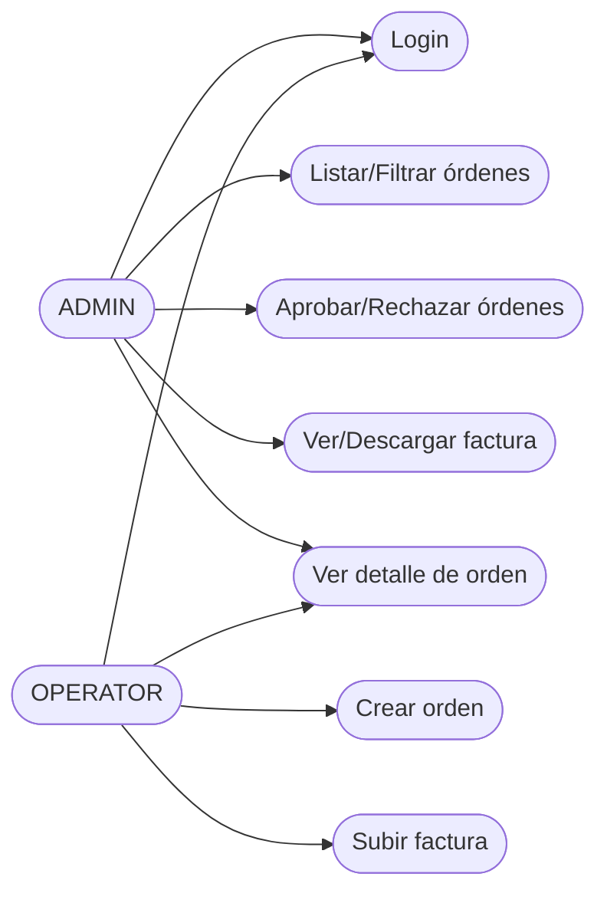
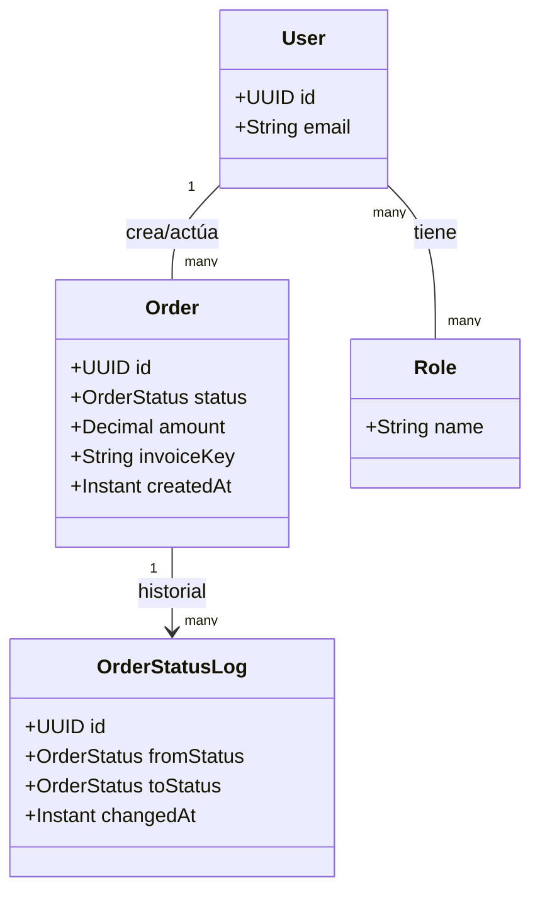
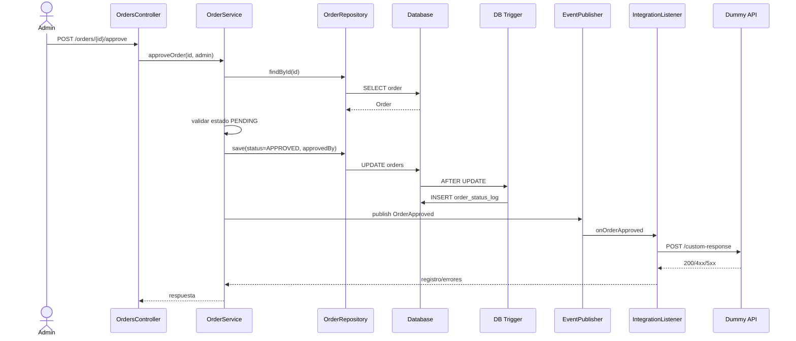
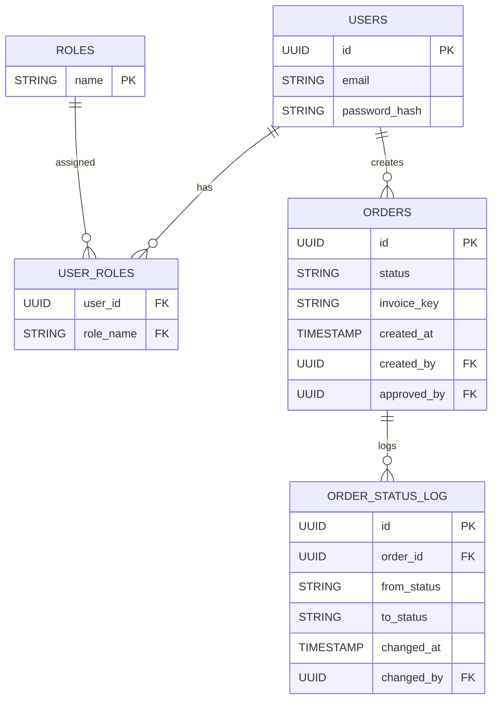

# Sistema de Gestión de Órdenes de Pago

## 1. Visión General de la Arquitectura
Se va a implementar un **Monolito Modular** estructurado en tres capas claramente definidas. Esta decisión técnica responde al principio de **"Complejidad Justificada"**: el diseño prioriza la mantenibilidad, la facilidad de pruebas y la claridad del código, evitando sobre-ingeniería innecesaria y garantizando un desarrollo ágil y robusto.

## 2. Estructura de Capas
El proyecto sigue principios de **DDD (Domain-Driven Design)**, donde el núcleo del negocio es independiente de los detalles de implementación:

* **Capa de Dominio (Core):** Contiene el modelo del negocio (`Order`, `OrderStatus`, `User`, `OrderStatusLog`). Es la capa central y no tiene dependencias externas, permitiendo que las reglas de negocio sean puras y fáciles de testear.
* **Capa de Aplicación:** Responsable de la orquestación. Contiene los servicios de casos de uso que coordinan las reglas de transición de estados y validaciones funcionales antes de persistir la información.
* **Capa de Infraestructura:** Implementa los detalles técnicos mediante adaptadores. Aquí reside la persistencia JPA, la seguridad con JWT, la integración con sistemas externos (Feign) y el manejo de archivos (Storage).

## 3. Integración y Resiliencia
Se han integrado componentes clave de Spring Cloud para asegurar la calidad bajo criterios de producción:
* **OpenFeign:** Utilizado para una comunicación declarativa y limpia con el sistema externo.
* **Resilience4j:** Implementado para proteger la estabilidad del sistema mediante el manejo de *timeouts* y políticas de reintento, asegurando que fallos en servicios externos no degraden la experiencia del usuario.

## 4. Patrones de Diseño Implementados
* **Repository Pattern:** Abstracción del acceso a datos, permitiendo desacoplar la lógica de negocio de la tecnología de persistencia.
* **Strategy Pattern:** Implementado en `StorageService` para alternar entre proveedores de almacenamiento (ej. local para desarrollo, S3 para producción) sin modificar la lógica de negocio.
* **Event-Driven:** Se utiliza el sistema de eventos de Spring para disparar notificaciones tras cambios de estado, promoviendo un código desacoplado y reactivo.

## 5. Base de Datos (SQL)
Se utilizará una **base de datos relacional (SQL)**.  
**PostgreSQL** es la opción principal por su soporte robusto de *triggers* y *stored procedures*.  
Para desarrollo local, puede usarse **H2** en memoria por simplicidad.  
La elección de SQL es clave porque el assessment exige auditoría con trigger y un procedimiento almacenado transaccional, lo cual no encaja bien en un modelo NoSQL.

## 6. Auditoría y Persistencia
Para garantizar el cumplimiento de los requerimientos de auditoría, se implementaron:
* **Triggers SQL:** Para asegurar la inmutabilidad del historial de estados (`order_status_log`).
* **Stored Procedures:** Gestión de procesos de archivado mediante transacciones (`BEGIN/COMMIT/ROLLBACK`), garantizando la integridad de los datos sensibles de forma eficiente.

## 7. Alcance del Proyecto
El sistema implementa el **MVP** solicitado:
* Gestión de ciclos de vida de órdenes (PENDING, APPROVED, REJECTED).
* Seguridad basada en JWT y control de acceso basado en roles (RBAC).
* Gestión de archivos bajo el contrato `StorageService`.
* Auditoría de estados y procesos de limpieza de datos.

## 8. Requerimientos Funcionales
* Autenticación con JWT y login por email/password.
* Autorización por roles (ADMIN, OPERATOR) con restricciones por endpoint.
* CRUD parcial de órdenes: crear, listar, filtrar y ver detalle.
* Cambio de estado de órdenes: aprobar o rechazar solo si están en PENDING.
* Subir y descargar factura (imagen o PDF) mediante multipart/form-data.
* Notificación a sistema externo cuando la orden pasa a APPROVED.
* Auditoría de cambios de estado con trigger en `order_status_log`.
* Proceso de archivado de órdenes REJECTED mediante stored procedure.

## 9. Requerimientos No Funcionales
* Manejo centralizado de errores y códigos HTTP coherentes.
* Tiempos de espera y reintentos controlados en integración externa.
* Registro de errores de integración y trazabilidad básica.
* Separación clara de capas para facilitar mantenimiento y pruebas.
* Seguridad mínima: expiración de JWT y control de acceso por rol.

## 10. Diagramas
Los siguientes diagramas sirven como apoyo para explicar de forma rápida el flujo y la estructura del sistema. Están en Mermaid para facilitar su lectura en GitHub.

### Casos de uso (roles)

### Diagrama de clases (dominio)

### Flujo de aprobación (secuencia)

### Modelo de datos (ERD)

